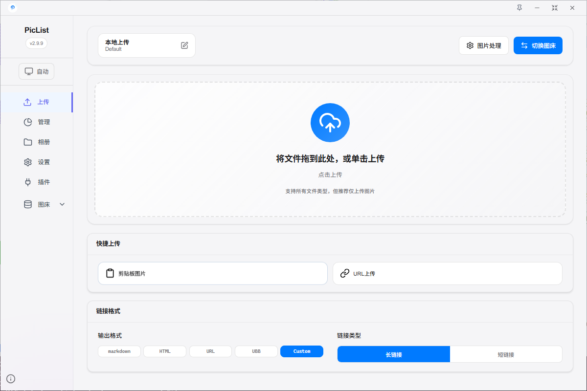
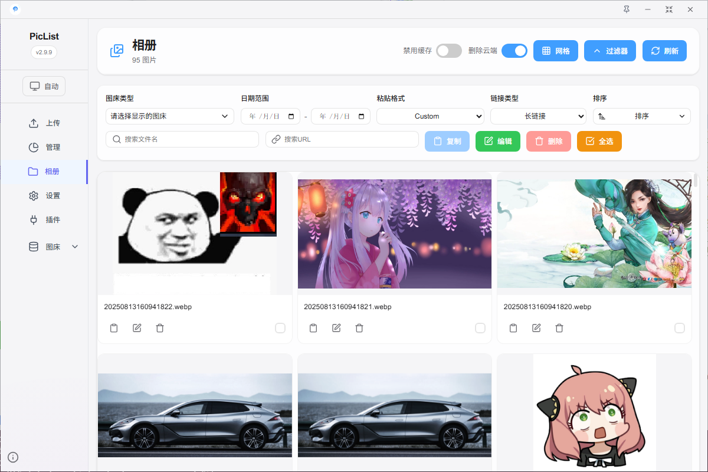
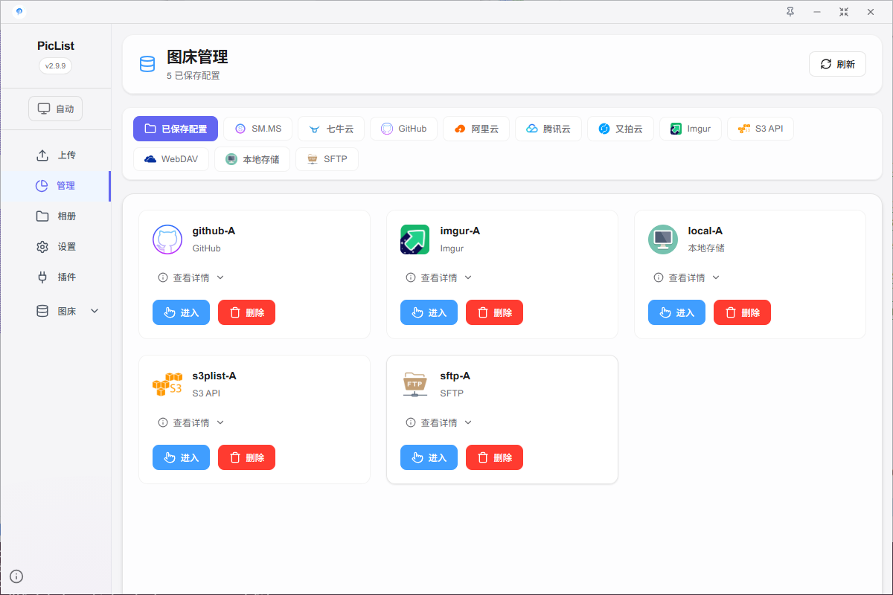
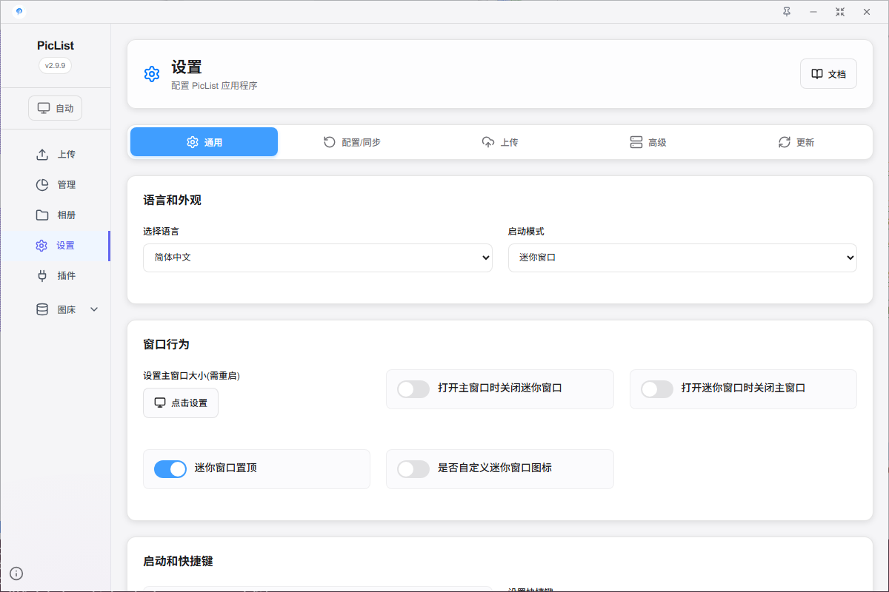
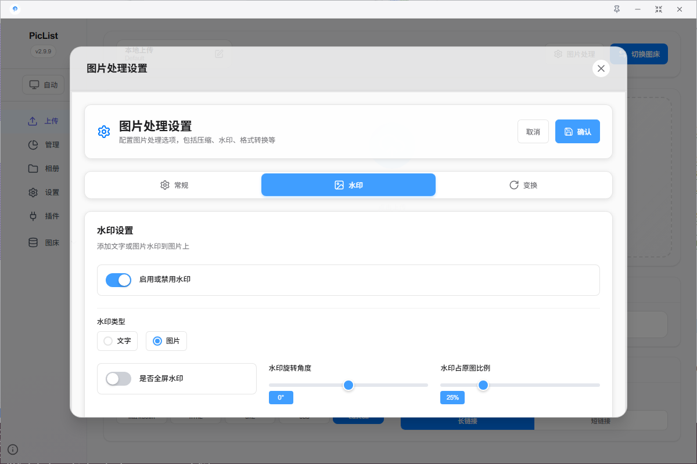
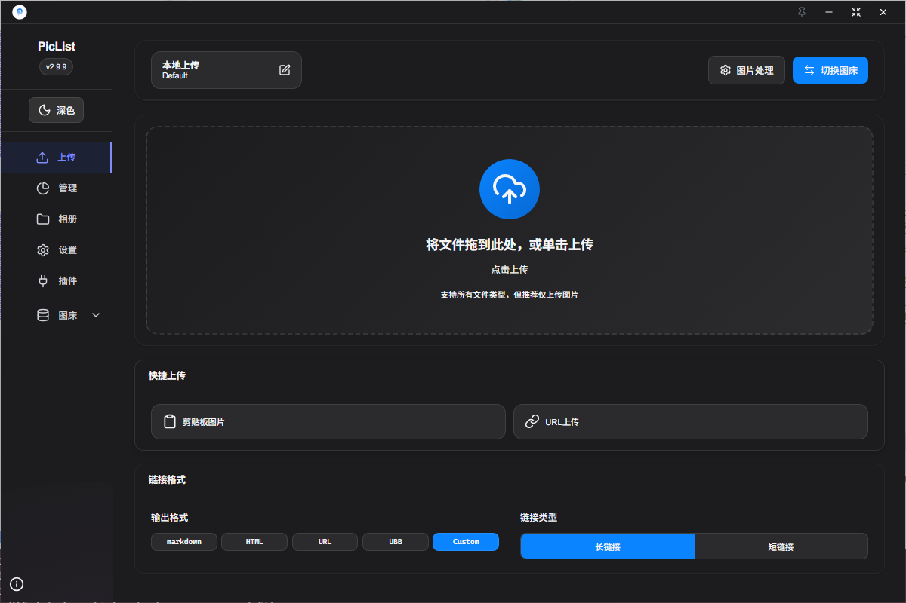

<div align="center">
  
  <h1>PicList</h1>
  <p><strong>Powerful cloud storage and image hosting management tool</strong></p>
  <a href="https://github.com/Kuingsmile/PicList/actions">
    
  </a>
  <a href="https://github.com/Kuingsmile/PicList/releases">
    
  </a>
  <a href="https://github.com/Kuingsmile/PicList/releases/latest">
    
  </a>
</div>


[简体中文](https://github.com/Kuingsmile/PicList/blob/dev/README_cn.md) | English

## 📑 Table of Contents

- [📑 Table of Contents](#-table-of-contents)
- [Introduction](#introduction)
- [Official Website](#official-website)
- [How to Migrate from PicGo](#how-to-migrate-from-picgo)
- [PicList-Core](#piclist-core)
- [Key Features](#key-features)
- [Integration Guides](#integration-guides)
  - [VSCode Integration](#vscode-integration)
  - [Typora Integration](#typora-integration)
    - [**Version 1.6.0-dev and above**](#version-160-dev-and-above)
    - [**Version \< 1.6.0-dev**](#version--160-dev)
  - [Obsidian Integration](#obsidian-integration)
  - [Docker Integration](#docker-integration)
    - [Using docker run](#using-docker-run)
    - [Using docker-compose](#using-docker-compose)
- [Supported Platforms](#supported-platforms)
- [Download and Install](#download-and-install)
  - [Direct Download](#direct-download)
  - [Scoop (Windows)](#scoop-windows)
  - [Winget (Windows)](#winget-windows)
  - [Homebrew (macOS)](#homebrew-macos)
  - [OS Requirements](#os-requirements)
    - [Windows](#windows)
    - [macOS](#macos)
    - [Linux](#linux)
- [Screenshots](#screenshots)
- [Development](#development)
  - [Prerequisites](#prerequisites)
  - [Getting Started](#getting-started)
  - [Development Mode](#development-mode)
  - [Production Build](#production-build)
- [Related Projects](#related-projects)
- [Community](#community)
- [License](#license)
- [Star Me](#star-me)

## Introduction

PicList is an efficient cloud storage and image hosting management tool built upon PicGo with extensive enhancements. It combines complete image hosting capabilities with comprehensive cloud storage management features, offering:

- All original PicGo functionality plus compatibility with most PicGo plugins
- Extended built-in image hosting platforms (WebDav, local hosting, SFTP, etc.)
- Cloud-synchronized file deletion in album view
- Comprehensive cloud storage management with file operations, search, and previews
- Built-in image processing tools (watermarks, compression, scaling, rotation, format conversion)

## Official Website

Please visit the [PicList official website piclist.cn](https://piclist.cn) for more information.

You can also visit the [DeepWiki of PicList](https://deepwiki.com/Kuingsmile/PicList) to learn more about the project architecture and development.

## How to Migrate from PicGo

PicList `V1.5.0` and above provide a `one-click migration` function. Enter the `Settings` page, click the button next to `Migrate from PicGo`, then restart the application for changes to take effect.

## PicList-Core

PicList uses a modified version of PicGo-Core called [PicList-core](https://github.com/Kuingsmile/PicList-Core), adapted for cloud deletion and extended with features like:

- Watermark addition
- Image compression, scaling, rotation, and format conversion
- CLI command support
- Built-in upload server via `picgo-server` command

To use PicList-core separately, visit [GitHub repo](https://github.com/Kuingsmile/PicList-Core) or the [npm package](https://www.npmjs.com/package/piclist).

## Key Features

- **Complete Compatibility**: Works with Typora, Obsidian, and most PicGo plugins
- **Extended Platform Support**: Added WebDav, Lsky Pro, local hosting, SFTP, and account-based Imgur uploads
- **Cloud-Sync Album**: Delete images from storage alongside local entries
- **Advanced Album Features**: Search, sort, and batch URL modification
- **Built-in Image Tools**: Add watermarks, compress, scale, rotate, and convert formats
- **Form Upload**: Share across multiple computers
- **Config Synchronization**: Save settings to GitHub/Gitee/Gitea repositories
- **Cloud Management**: Browse directories, search files, batch operations, and more
- **Multi-format Previews**: View images, videos, text files, and Markdown files (see [supported formats](https://github.com/Kuingsmile/PicList/blob/dev/supported_format.md))
- **Batch Operations**: Rename cloud files with regular expressions
- **Link Sharing**: Generate pre-signed URLs for private storage buckets
- **Usability Improvements**: Auto-updates, multiple startup modes, UI enhancements, and more

## Integration Guides

### VSCode Integration

Install the [VS-PicList](https://marketplace.visualstudio.com/items?itemName=Kuingsmile.vs-piclist) plugin, which integrates directly with PicList desktop software and supports a variety of uploads and cloud deletion operations in VSCode.

### Typora Integration

#### **Version 1.6.0-dev and above**

**Typora 1.6.0-dev and later versions natively support PicList.** For versions below 1.10.6, set Typora's language to Chinese.

If your Typora version is below 1.8.0, set both the PicList and PicGo (app) upload service paths to your PicList installation path.

[Typora download link](https://typora.io/releases/all)

#### **Version < 1.6.0-dev**

For Windows, in Typora settings:

1. Set upload service to `PicGo(app)`
2. Set `PicGo path` to your PicList installation path


Alternatively, install PicList-core with `npm install piclist` and set the upload service to `PicGo-Core (command line)`.

### Obsidian Integration

1. Install the "Image auto upload Plugin" from community plugins
2. Set the default uploader to PicGo(app)
3. Configure PicGo server as `http://127.0.0.1:36677/upload`
4. For cloud deletion support, set the deletion interface to `http://127.0.0.1:36677/delete`


### Docker Integration

#### Using docker run

```bash
docker pull kuingsmile/piclist:latest
docker run -d \
  --name piclist \
  --restart always \
  -p 36677:36677 \
  -v "./piclist:/root/.piclist" \
  kuingsmile/piclist:latest \
  node /usr/local/bin/picgo-server -k piclist123456
```

Change `./piclist` to your config directory path and `piclist123456` to your preferred secret key.

#### Using docker-compose

```yaml
version: '3.3'

services:
  node:
    image: 'kuingsmile/piclist:latest'
    container_name: piclist
    restart: always
    ports:
      - 36677:36677
    volumes:
      - './piclist:/root/.piclist'
    command: node /usr/local/bin/picgo-server -k piclist123456
```

Run with `docker-compose up -d`

## Supported Platforms

|          Platform          | Album Cloud Deletion | Cloud Storage Management |
| :------------------------: | :------------------: | :----------------------: |
|       Built-in AList       |          ✔️           |            ✔️             |
|           SM.MS            |          ✔️           |            ✔️             |
|           Github           |          ✔️           |            ✔️             |
|           Imgur            |          ✔️           |            ✔️             |
|       Tencent COS V5       |          ✔️           |            ✔️             |
|         Aliyun OSS         |          ✔️           |            ✔️             |
|           Upyun            |          ✔️           |            ✔️             |
|           Qiniu            |          ✔️           |            ✔️             |
| S3 API compatible platform |          ✔️           |            ✔️             |
|           WebDAV           |          ✔️           |            ✔️             |
|           Local            |          ✔️           |            ✔️             |
|       Built-in SFTP        |          ✔️           |            ✔️             |
|         Doge Cloud         |          ✔️           |            ✔️             |
|    PicList(Lasso-Doll)     |          ✔️           |            ✔️             |
|          Lsky Pro          |          ✔️           |            ✔️             |
|    Custom API platform     |          ×           |            ×             |

**Supported Plugins with Cloud Deletion:**

- [picgo-plugin-s3](https://github.com/wayjam/picgo-plugin-s3)
- [picgo-plugin-alist](https://github.com/jinzhi0123/picgo-plugin-alist)
- [picgo-plugin-huawei-uploader](https://github.com/YunfengGao/picgo-plugin-huawei-uploader)
- [picgo-plugin-dogecloud](https://github.com/w4j1e/picgo-plugin-dogecloud)

## Download and Install

### Direct Download

[Download the latest release](https://github.com/Kuingsmile/PicList/releases/latest)

### Scoop (Windows)

```bash
scoop bucket add lemon https://github.com/hoilc/scoop-lemon
scoop install lemon/piclist
```

### Winget (Windows)

```bash
winget install Kuingsmile.PicList
```

### Homebrew (macOS)

```bash
# Install
brew install piclist --cask

# Uninstall
brew uninstall piclist
```

### OS Requirements

#### Windows

- **Supported Versions**: Windows 10 and later
- **Architectures**: `ia32` (x86), `x64` (amd64), `arm64`

#### macOS

- **Supported Versions**: macOS Big Sur (11) and later
- **Architectures**: Intel (x64) and Apple Silicon (arm64)

#### Linux

- **Supported Versions**:
  - Ubuntu 18.04 and later
  - Fedora 32 and later
  - Debian 10 and later

## Screenshots








## Development

### Prerequisites

1. Node.js 20 + and Git
2. Knowledge of npm
3. Xcode for Mac or Visual Studio for Windows

### Getting Started

```bash
git clone https://github.com/Kuingsmile/PicList.git
cd PicList
yarn  # Do not use npm install
```

To contribute, see the [contribution guide](https://github.com/Kuingsmile/PicList/blob/dev/CONTRIBUTING_EN.md).

### Development Mode

```bash
yarn run dev
```

Development mode has hot-reload but may be unstable. If the process crashes, exit with `Ctrl+C` and restart.

Note: The PicList application icon will appear in your taskbar/system tray while in development mode.

### Production Build

```bash
yarn run build
```

The built installer will be available in the `dist_electron` directory.

For network issues with electron-builder, set the mirror:

**Linux/macOS:**

```bash
export ELECTRON_MIRROR="https://npmmirror.com/mirrors/electron/"
```

**Windows:**

```cmd
set ELECTRON_MIRROR=https://npmmirror.com/mirrors/electron/
```

## Related Projects

- [PicList-Core](https://github.com/Kuingsmile/PicList-Core): Core library based on PicGo-Core for CLI and development
- [PicHoro](https://github.com/Kuingsmile/PicHoro): Mobile app companion for PicList
- [VS-PicList](https://github.com/Kuingsmile/vs-PicList/): VSCode plugin for PicList

## Community

Join our Telegram group for questions and discussion:

[PicList TG Group](https://t.me/+rq8y7wsj7Pg5ZTg1)


## License

This project is open source under the MIT license.

[MIT](https://opensource.org/licenses/MIT)

Copyright (c) 2017-present Molunerfinn  
Copyright (c) 2023-present Kuingsmile

## Star Me

[](https://github.com/kuingsmile/PicList/stargazers)

[](https://github.com/kuingsmile/PicList/stargazers)
