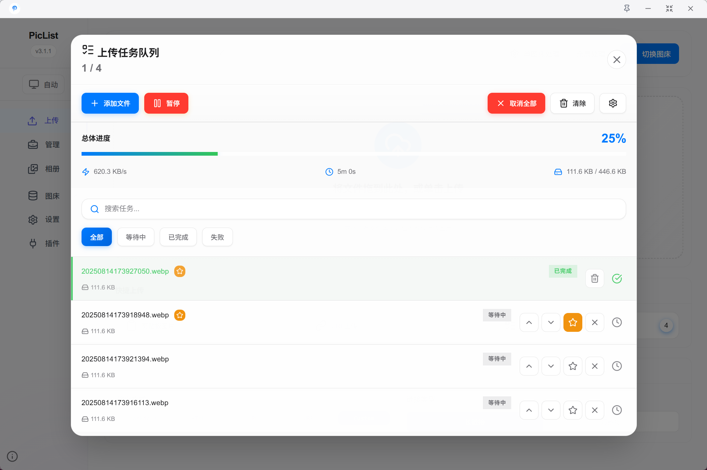

## 🎉 [v3.2.0] Release note

### ✨ Features

- Add Upload Task System, now you can add files to the task, upload them at intervals, and adjust the priority at any time to avoid platform API rate limits.

- Now supports setting image preprocessing/renaming options for each individual image bed, the effective order is `Image Bed Settings > Platform Settings > Global Settings`
- Optimized the display logic of the image preprocessing options for the image bed platform settings and individual image bed settings, now more clearly displaying the currently effective configuration
- Now automatically saves the current UI selection status of multiple pages
- Added Linux Arm64 platform support and added deb installation package
- Optimized update page display, now automatically renders md format update instructions

### 🐛 Bug Fixes

- Fixed an issue where the version number displayed extra characters on the update check page
- Fixed an issue where fine format conversion could not be set on the image processing page
- Fixed a performance issue caused by repeated execution of save functions on some pages
